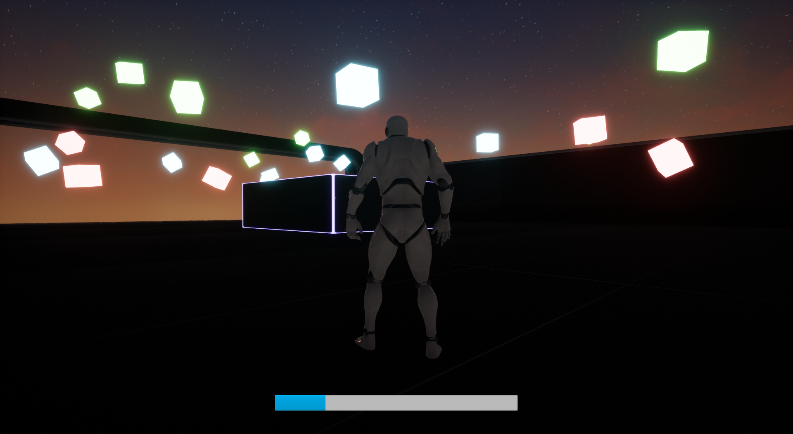

# Projet monde virtuel

Thomas Saudemont

## Sujet

Le but du jeu est de survivre le plus longtemps possible. La vie du joueur baisse sans cesse, mais il peut regagner de la vie en attrapant des cubes verts. Il peut également attraper des cubes bleus et des cubes rouges, augmentant respectivement sa hauteur de saut et sa vitesse de déplacement. Le délais d'apparition des cubes varie légèrement d'une fois sur l'autre.

## Programmation graphique

## Ressources

les classes C++ sont disponibles dans le répertoire GitHub.

Lien vers l'intégralité du projet : 